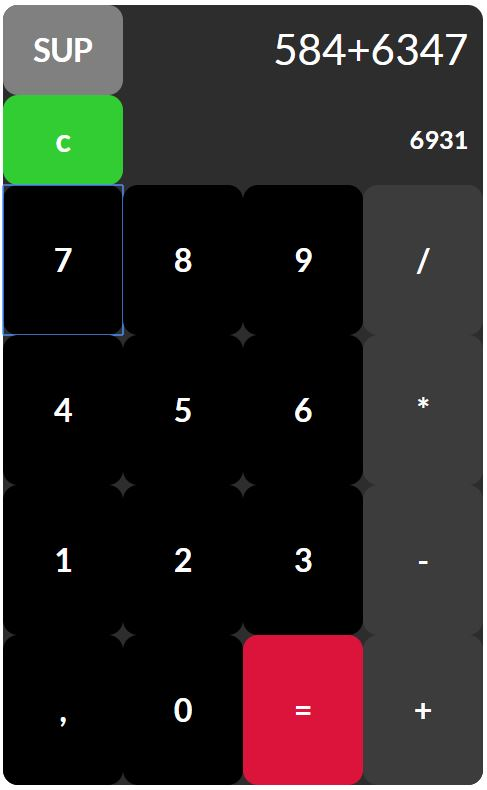

# CalculatorAngular

This project was generated with [Angular CLI](https://github.com/angular/angular-cli) version 7.1.4.

This is a simple calculator with an on the fly result function :

## Further help

To get more help on the Angular CLI use `ng help` or go check out the [Angular CLI README](https://github.com/angular/angular-cli/blob/master/README.md).
